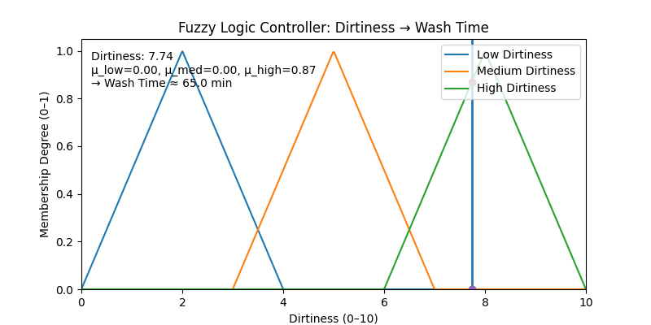

# Fuzzy Logic Washing Machine Controller

Ever wondered how modern washing machines decide **how long to wash your clothes**?  
This project gives you a simple, visual way to see how **Fuzzy Logic** makes that decision.

Instead of just saying *"dirty"* or *"clean"*, fuzzy logic looks at the **degree of dirtiness** (from 0 to 10) and decides a wash time that makes sense - not too short, not too long.

---

## What Does It Do?

- Shows how the washing machine thinks about dirtiness: **Low, Medium, High**.
- Animates how dirtiness levels can change over time.
- Tells you, step by step, how "dirty" your clothes are and how many minutes it will wash them.
- Creates a cool **GIF animation** so you can watch it all happen.

---

## The Rules Behind It

The machine uses three simple rules:
- If clothes are **Low dirty**, wash for a **short time**.
- If clothes are **Medium dirty**, wash for a **medium time**.
- If clothes are **High dirty**, wash for a **long time**.

That’s it - simple, human-like reasoning instead of rigid "yes or no" logic.

---

## What You’ll See

The animation will:
- Draw three curves (Low, Medium, High dirtiness).
- Move a vertical line to show the current dirtiness.
- Show the "strength" of each level (how low/medium/high it is at that moment).
- Tell you how long the wash will take for that moment.

this is a demo:  

---
