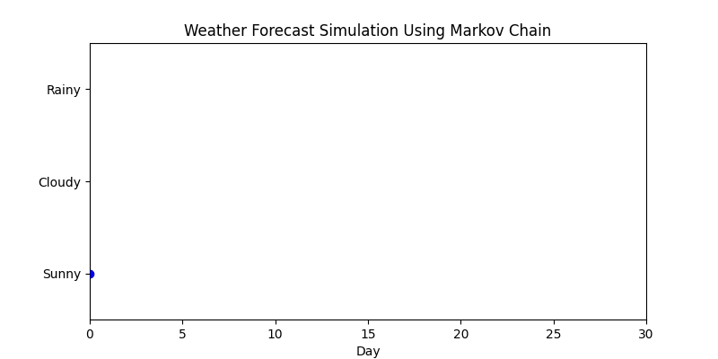

## Markov Chain
A Markov Chain is a mathematical model used to predict the next state of a system based only on its current state, not on the past history. It is an example of a stochastic process in probability and mathematics.

## Mathematical Formula
$$\large P(Xt+1 =j∣Xt =i )=Pij$$​

Explanation (Step by Step)

  - 𝑋𝑡 : the state at time 𝑡
  - 𝑋𝑡+1: the state at the next time step.
  - 𝑖: the current state.
  - 𝑗: the next state.
  - 𝑃𝑖𝑗​: the probability of moving from state 𝑖 to state 𝑗.

The main rule of a Markov Chain is:

$$\large P(Next State∣Current State)=Transition Probability$$

## Relation with Machine Learning (ML)

Markov Chains are very useful in AI and ML because many real-world problems depend on sequences and probabilities:

  - Hidden Markov Models (HMMs): Used in speech recognition, handwriting recognition, and part-of-speech tagging in Natural Language Processing (NLP).

  - Reinforcement Learning: The concept of Markov Decision Processes (MDP) is built on Markov Chains. Here, an agent makes decisions in an environment where the next state depends only on the current state and chosen action.

  - Time Series Prediction: Weather forecasting, stock price movement, and user behavior analysis can be modeled using Markov Chains.

