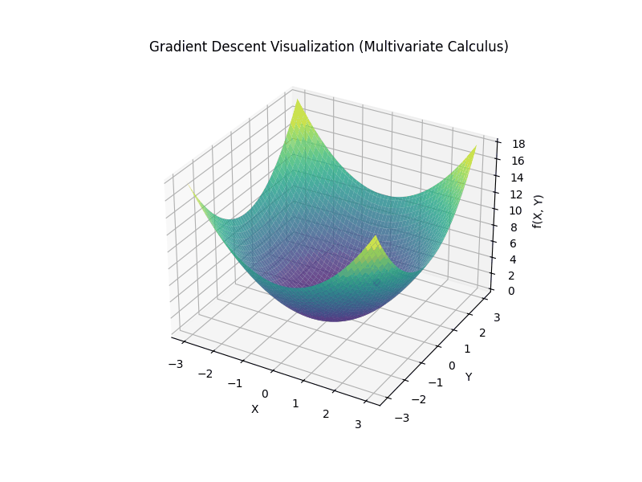

## Multivariate Calculus – Gradient Descent Visualization

This  visualizes the **gradient descent** process on a simple 3D quadratic function using **Matplotlib** and **NumPy**.  
It helps in understanding how optimization algorithms iteratively move towards the **minimum point** of a multivariable function.

---

## Mathematical Concept

The function used in this example is:

$$
f(x, y) = x^2 + y^2
$$

### Gradient

The **gradient** (vector of partial derivatives) of this function is:

$$
\nabla f(x, y) = [2x, 2y]
$$

This gradient points in the direction of the **steepest ascent**, and gradient descent moves in the **opposite direction** to minimize the function.

---

### Gradient Descent Update Rule

$$
(x, y)_{new} = (x, y)_{old} - \alpha \nabla f(x, y)
$$

Where:
- \( \alpha \) → learning rate (step size)  
- \( \nabla f(x, y) \) → gradient at the current point  
- The update is repeated until convergence or for a set number of steps

---

## Explanation (Step by Step)

1. **Function Definition:**  
   Defines \( f(x, y) = x^2 + y^2 \), a smooth convex surface (bowl-shaped).  

2. **Gradient Function:**  
   Computes the gradient as \( [2x, 2y] \).  

3. **Initialization:**  
   Starts from an initial point (2.5, –2.0).  

4. **Learning Rate:**  
   A small step size (0.15) ensures a smooth descent without overshooting.  

5. **Iterations:**  
   The algorithm iteratively updates the position towards the minimum at (0, 0).  

6. **Visualization:**  
   The 3D surface plot shows the function, while a red point and line trace the optimization path.  

7. **Animation:**  
   The process is animated and saved as a GIF (`multivariate_calculus.gif`).

---

## Code Summary

- **Language:** Python  
- **Libraries Used:**  
  - `NumPy` → numerical computations  
  - `Matplotlib` → 3D plotting and animation  
- **Output:** `multivariate_calculus.gif` (shows the descent path on the 3D surface)

---

## Visualization

The animation below illustrates how gradient descent iteratively finds the global minimum of the function.

---

## Relation with Machine Learning (ML)

Gradient Descent is the **core optimization algorithm** in many ML and Deep Learning methods.

Used in:
- **Linear Regression** – minimizing mean squared error  
- **Logistic Regression** – optimizing classification loss  
- **Neural Networks** – updating weights to minimize loss functions  

This visualization provides an intuitive understanding of how these models “learn” by following the gradient to minimize errors.
